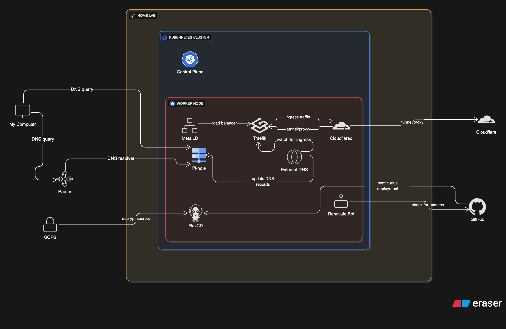

  

This repository contains my homelab setup using **Infrastructure as Code (IaC)** and modern automation tools, running on **bare-metal Proxmox**.  

## 🚀 Stack

  
  
  
  
  
  
  
  

## 📂 Structure

- **[Proxmox](https://www.proxmox.com/)** → Base hypervisor running all VMs and containers
- **[terraform/](https://www.terraform.io/)** → Infrastructure provisioning (VMs, networking, storage on Proxmox)
- **[ansible/](https://www.ansible.com/)** → Node configuration and automation
- **[talos/](https://www.talos.dev/)** → Kubernetes cluster OS + secrets
- **[kubernetes/](https://kubernetes.io/)** → GitOps-managed workloads (Flux, apps, infra)
- **[FluxCD](https://fluxcd.io/)** → GitOps continuous delivery for Kubernetes
- **[devenv.nix](https://devenv.sh/)** → Developer environment setup
- **[Taskfile.yml](https://taskfile.dev/)** → Reproducible commands with Task

## 🌾 Core
- [Longhorn](https://longhorn.io/) - distributed block storage for Kubernetes.
- [Metallb](https://metallb.universe.tf/) - load-balancer for bare metal Kubernetes clusters.
- [Traefik](https://github.com/traefik/traefik) - HTTP reverse proxy and load balancer.
- [CloudNativePG](https://cloudnative-pg.io/) - highly available PostgreSQL database cluster.

---
💡 Built for learning, automation, GitOps, and experimentation.

  

