### 🔒 Git → FluxCD → SOPS → Cluster

```mermaid
flowchart TD
    Git[Git Repository] --> Flux[FluxCD]
    Flux --> SOPS[SOPS Secrets Decryption]
    Flux --> Apps[Applications Deployment]

    style Git fill:#111827,stroke:#333,stroke-width:2px
    style Flux fill:#f59e0b,stroke:#333,stroke-width:2px
    style SOPS fill:#b91c1c,stroke:#333,stroke-width:2px
    style Apps fill:#2563eb,stroke:#333,stroke-width:2px
```

**Flow explanation:**  
1. **Git Repository**: Stores Kubernetes manifests and SOPS-encrypted secrets.  
2. **FluxCD**: Watches the repo, detects changes, and applies them to the cluster.  
3. **SOPS Secrets**: Flux decrypts secrets automatically before applying them.  
4. **Applications Deployment**: Flux deploys apps (Traefik, MetalLB, Longhorn, etc.) using manifests and decrypted secrets.  

This illustrates the flow from the Git repository through FluxCD, where SOPS secrets are decrypted, to the applications running in the cluster.
