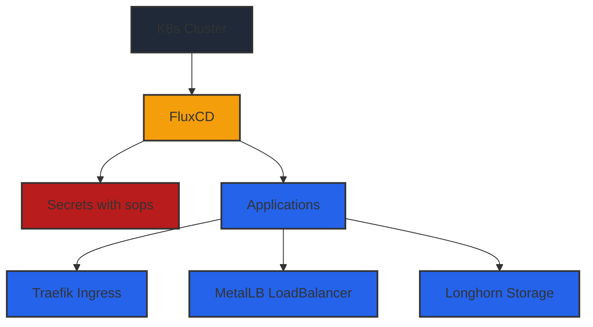

```mermaid
flowchart TD
    K8s[K8s Cluster] --> F[FluxCD]
    F --> S[Secrets with sops]
    F --> A[Applications]
    A --> T[Traefik Ingress]
    A --> M[MetalLB LoadBalancer]
    A --> L[Longhorn Storage]

    style K8s fill:#1f2937,stroke:#333,stroke-width:2px
    style F fill:#f59e0b,stroke:#333,stroke-width:2px
    style S fill:#b91c1c,stroke:#333,stroke-width:2px
    style A fill:#2563eb,stroke:#333,stroke-width:2px
    style T fill:#2563eb,stroke:#333,stroke-width:2px
    style M fill:#2563eb,stroke:#333,stroke-width:2px
    style L fill:#2563eb,stroke:#333,stroke-width:2px
```

