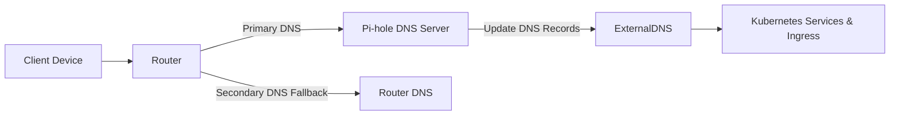

# DNS Management with Pi-hole & ExternalDNS

This diagram and explanation show how DNS resolution works in our Kubernetes cluster using Pi-hole and ExternalDNS, with the router providing fallback DNS.

## DNS Flow Diagram



## How it Works

1. **Client Devices** query the router for DNS.
2. The **Router** forwards queries to Pi-hole as primary DNS.
3. **Pi-hole** responds using cached entries or queries **ExternalDNS**.
4. **ExternalDNS** monitors Kubernetes:

   * Services annotated for DNS.
   * Ingresses using the Traefik class.
5. ExternalDNS updates Pi-hole with the DNS entry; Kubernetes **never updates Pi-hole directly**.
6. If Pi-hole cannot resolve a query, the router DNS acts as a fallback.

## Example Service Annotation

```yaml
apiVersion: v1
kind: Service
metadata:
  name: pihole-svc
  annotations:
    metallb.universe.tf/allow-shared-ip: pihole-svc
    external-dns.alpha.kubernetes.io/hostname: pihole.lab.local
spec:
  type: LoadBalancer
  ports:
    - port: 80
      targetPort: 80
  selector:
    app: pihole
```

This annotation ensures that **ExternalDNS** creates the DNS record `pihole.lab.local` in Pi-hole for this service.

## Benefits

* Automatic, dynamic DNS for all cluster services via ExternalDNS.
* Supports Traefik-managed ingress automatically, always via ExternalDNS.
* Eliminates manual `/etc/hosts` updates.
* Ensures consistent DNS resolution across your network with router fallback.

